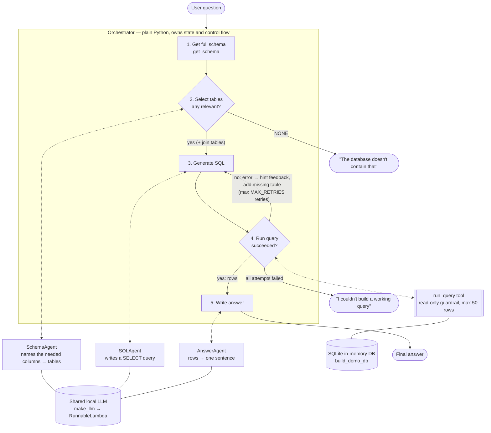
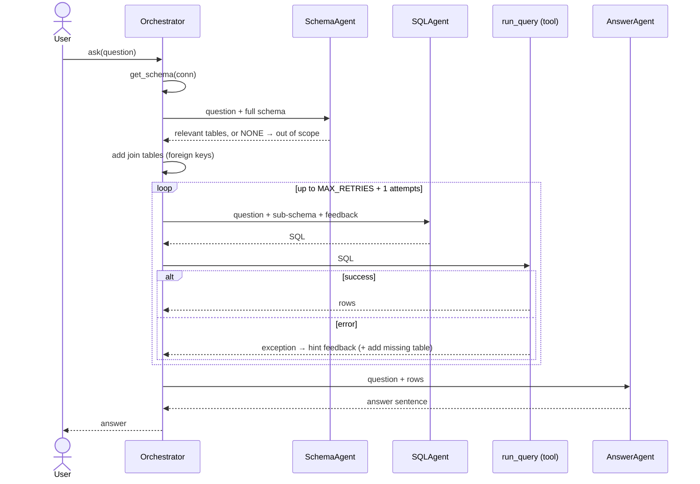

# Session 4 — Multi-Agent System (NL → SQL)

A minimal multi-agent workflow that answers natural-language questions about a
database. It runs a small Hugging Face model locally (no API keys needed) and
uses LangChain to compose prompts and the model.

```bash
uv sync
uv run python multi-agent.py

# Try another model without touching the code
HF_MODEL_ID=Qwen/Qwen2.5-Coder-3B-Instruct uv run python multi-agent.py
```

The default model is `Qwen/Qwen2.5-Coder-1.5B-Instruct` (~3 GB download, CPU is
fine). The 0.5B version is faster but not usable here: it invents columns
(e.g. `bookings.price`) and can't tell when a question is out of scope.

## Architecture



### Components

| Component | Role | Uses the LLM? |
|---|---|---|
| `Orchestrator` | Runs the fixed pipeline, passes data between agents, handles retries. Does the deterministic parts in code: adds join tables, turns SQLite errors into hints ("column `price` exists only in `flights`") and adds a missing table to the schema. | No |
| `SchemaAgent` | Names the columns (`table.column`) the question needs; their tables become the sub-schema. Replies `NONE` for questions the database can't answer. | Yes |
| `SQLAgent` | Writes the SQL; on failure it receives the error hint and tries again. | Yes |
| `run_query` | The **tool**: the only code that touches the DB. Rejects anything that isn't a `SELECT`. In production this would be exposed by an MCP server. | No |
| `AnswerAgent` | Turns the result rows into a natural-language answer. | Yes |

Each agent is the same pattern: `PromptTemplate | llm | StrOutputParser()`,
followed by defensive parsing of the plain-text output (small local models
can't reliably produce JSON).

### What makes a small model work here

* **Schema as DDL with foreign keys** (`CREATE TABLE bookings (... flight_id INTEGER REFERENCES flights(flight_id) ...); -- which customer booked which flight`).
  Code models are trained on text-to-SQL data in this format; the `REFERENCES`
  clauses are what tell the model a booking's price lives in `flights`.
* **Ask for columns, not tables.** "Which tables?" gets almost every table back;
  "which `table.column`?" makes the model find where each piece of data lives.
* **Prompt in the training format** (`-- question` then `SELECT`), so the model
  replies with bare SQL instead of an explanation. The parser still strips
  fences and prose and keeps only the first statement.
* **Refuse early.** If no column is relevant, stop before the SQL step:
  otherwise the model hallucinates tables to satisfy the request.
* **Actionable error feedback.** `no such column: b.price` alone makes the model
  repeat itself; adding "exists only in table(s): flights" fixes it on the next try.

### Sequence of one question


